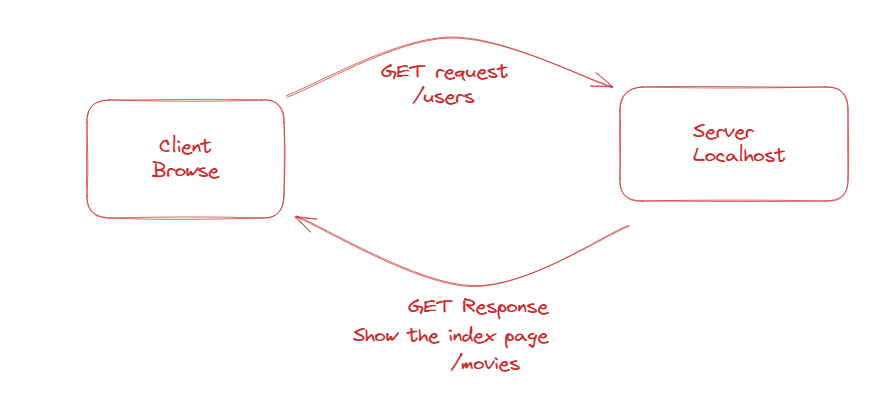
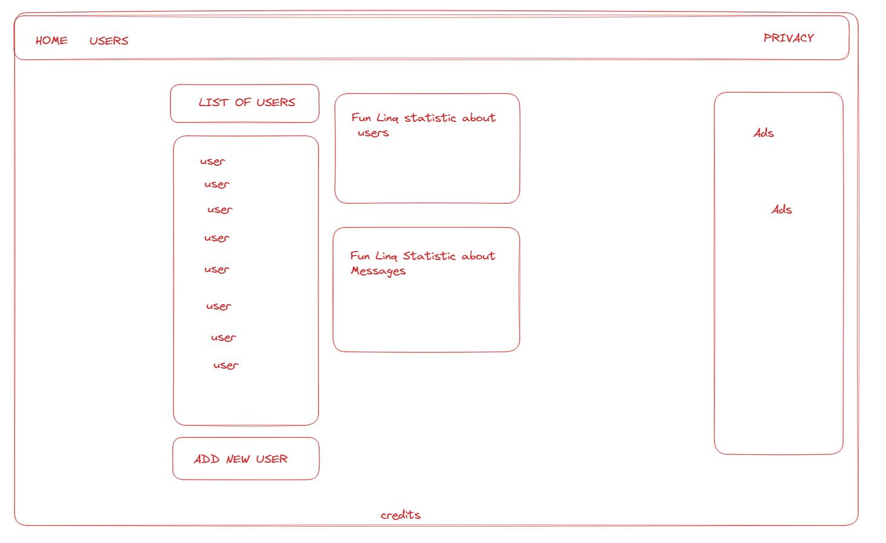

# MvcMessageLogger Planning Assets

## Iteration 1 - Creating and Viewing Users

#### 
#### 

## Iteration 2 - "Login" and Create Messages

#### REPLACE THIS HEADER WITH YOUR ITERATION 2 REQUEST/RESPONSE IMAGE
#### REPLACE THIS HEADER WITH YOUR ITERATION 2 WIREFRAME
